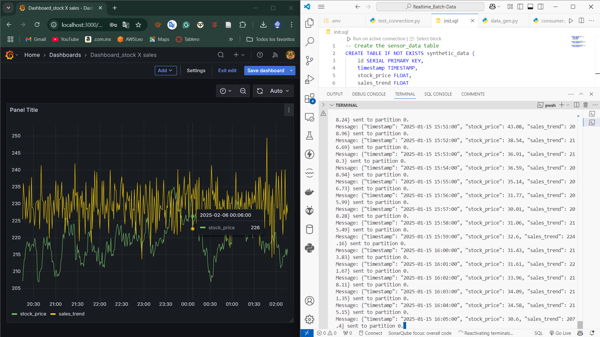

# KafkaDataPipeline

KafkaDataPipeline is a scalable data processing solution that integrates both real-time and batch processing using Apache Kafka, Python, and PostgreSQL. The project demonstrates a robust architecture where a producer ingests synthetic data into Kafka, a consumer persists the data into PostgreSQL, and an ETL process transforms and summarizes the stored data. Docker Compose is used to orchestrate all components for seamless deployment and testing.


## Table of Contents
- [Overview](#overview)
- [Features](#features)
- [Architecture](#architecture)
- [Technologies Used](#technologies-used)
- [Folder Structure](#folder-structure)
- [Installation](#installation)
- [Usage](#usage)
  - [Running with Docker Compose](#running-with-docker-compose)
  - [Testing the Database Connection](#testing-the-database-connection)
  - [Visualization Dashboard](#visualization-dashboard)
- [Contributing](#contributing)
- [License](#license)

## Overview
KafkaDataPipeline is designed to handle a high volume of data in real time and perform batch processing for summarization and analysis. The system comprises several modular components:

- **Producer**: Reads synthetic data from a Parquet file and sends it to Apache Kafka.
- **Kafka**: Serves as the messaging backbone, temporarily storing and forwarding data.
- **Consumer**: Consumes data from Kafka and inserts it into a PostgreSQL database.
- **ETL Process**: Extracts data from PostgreSQL, transforms it (e.g., calculates averages), and loads the summarized data into dedicated summary tables.
- **Dashboard (Grafana)**: Visualizes key metrics and trends from the data stored in PostgreSQL.

## Features
- **Real-Time Data Ingestion**: Uses Kafka for robust, real-time messaging.
- **Batch Processing**: ETL process to aggregate and summarize data.
- **Database Persistence**: Stores raw and processed data in PostgreSQL.
- **Containerized Deployment**: Fully orchestrated using Docker Compose.
- **Scalability**: Modular design enables scaling of producers, consumers, and processing components.
- **Visualization**: Integration with Grafana for real-time dashboards (optional).

## Architecture
The project architecture can be summarized in the following flow:

```
                [Synthetic Data Generation]
                          (Python)
                              │
                              ▼
                [Producer (Python)]
        (Reads synthetic_data.parquet and sends messages to Kafka)
                              │
                              ▼
                         [Apache Kafka]
             (Messaging backbone for real-time data streaming)
                              │
           ┌──────────────────┴──────────────────┐
           │                                     │
           ▼                                     ▼
  [Consumer (Python)]                     [ETL Process (Python)]
  (Consumes messages from Kafka,          (Extracts, transforms, and loads
   inserts data into PostgreSQL)            summarized data into PostgreSQL)
           │                                     │
           └─────────────┬───────────────────────┘
                         │
                         ▼
               [PostgreSQL Database]
      (Stores raw data in synthetic_data table and summary tables)
                         │
                         ▼
               [Grafana Dashboards]
   (Visualizes metrics and trends in real-time or batch mode)
```

## Technologies Used
- **Apache Kafka**: For real-time data streaming.
- **Python**: For data generation, consumption, and ETL processes.
- **Pandas & NumPy**: For data manipulation and synthetic data generation.
- **PostgreSQL**: For data persistence.
- **SQLAlchemy**: For interacting with PostgreSQL in the ETL process.
- **Docker & Docker Compose**: For containerizing and orchestrating services.
- **Grafana** *(Optional)*: For data visualization.

## Folder Structure
```
KafkaDataPipeline/
├── consumer/
│   └── consumer.py         # Kafka consumer that writes data to PostgreSQL
├── data/
│   └── synthetic_data.parquet  # Generated synthetic data file
├── database/
│   └── database.py         # Database connection and insertion functions
├── etl/
│   └── etl.py              # ETL process to transform and load summary data
├── producer/
│   └── producer.py         # Kafka producer that sends synthetic data
├── .env                    # Environment variables for Docker Compose
├── docker-compose.yml      # Docker Compose configuration for all services
└── README.md               # Project documentation
```

## Installation
### Clone the Repository:
```bash
git clone https://github.com/yourusername/KafkaDataPipeline.git
cd KafkaDataPipeline
```

### Ensure Docker and Docker Compose are Installed:
Install Docker and Docker Compose if you haven’t already.

### Configure Environment Variables:
Update the `.env` file if needed. The default configuration is set up for:
- PostgreSQL on port `5432`
- Kafka on port `29092` for internal communication
- Credentials as defined in the `.env` file

## Usage
### Running with Docker Compose
Start all services using Docker Compose:
```bash
docker-compose up -d --build
```
This command will build and run the following services:
- Zookeeper
- Kafka
- Producer
- Consumer
- PostgreSQL
- ETL process

### Testing the Database Connection
To verify that PostgreSQL is running and accessible:
```bash
docker exec -it postgres psql -U admin -d kafka_data
```
Within the PostgreSQL shell, you can run:
```sql
SELECT * FROM synthetic_data LIMIT 10;
```

### Visualization Dashboard
(Optional) Configure Grafana to visualize your data:
#### Add a Grafana Service:
You can add a Grafana container to your `docker-compose.yml` if desired.

#### Set Up a Data Source:
In Grafana, create a PostgreSQL data source with the following parameters (adjust based on your setup):
- **Host**: `postgres:5432` (if Grafana is in the same network) or `localhost:5432` (if running locally)
- **Database**: `kafka_data`
- **User**: `admin`
- **Password**: `admin123`

#### Create Dashboards:
Build dashboards with queries such as:
```sql
SELECT
  "timestamp" AS time,
  stock_price,
  sales_trend
FROM
  synthetic_data
ORDER BY
  "timestamp" ASC;
```
Configure auto-refresh intervals to display real-time updates.

## Contributing
Contributions are welcome! If you find an issue or have suggestions for improvements, please open an issue or submit a pull request.

